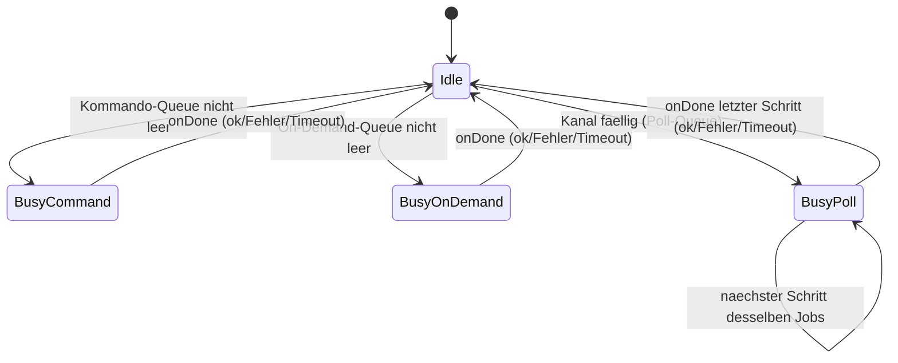
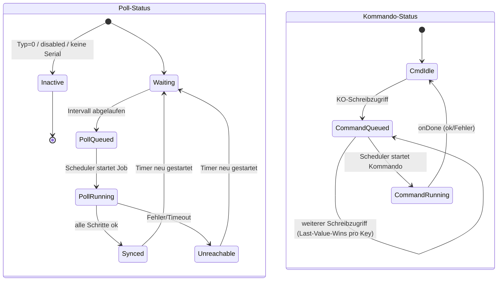

## Skizze: Asynchrone RPC-Verarbeitung für OFM-Homematic (nur Entwurf, keine Umsetzung)

### Ausgangslage

Aktuell läuft jeder RPC-Call (`RpcUtil::sendRequestGetResponseDoc`) synchron: `.send()` + Busy-Wait auf `webclient.loop()`. Zwei Aufrufer-Pfade nutzen das:

- **Polling** (HomematicChannel.cpp `update()`): zyklisch, bis zu 2 sequentielle Requests (Kanal `0` + Gerätekanal), Abbruch bei erstem Fehler.
- **Kommandos** (HomematicChannelSwitchActuator.cpp `processDeviceSpecificInputKo`): wird direkt aus der KO-Verarbeitung (`processInputKo`) heraus aufgerufen – blockiert also aktuell den Bus-Telegramm-Handler.

### Kernidee: zentraler Scheduler mit 3 Prioritätsstufen

Ein neuer, modul-weiter Scheduler (z. B. in `RpcUtil` erweitert oder eigene `RpcScheduler`-Klasse, gehalten von `HomematicModule`) verwaltet **genau einen** In-Flight-Request und mehrere Warteschlangen, die bei Leerlauf von oben nach unten bedient werden:

1. **Kommandos** (`rpcSetValue*` aus KO-Schreibzugriffen) – höchste Priorität, sollen "sofort" raus.
2. **On-Demand-Aktionen** (Function-Property `ScanResult`/`DeviceInfo`, vom Nutzer in ETS ausgelöst) – mittel.
3. **zyklisches Polling** (`getParamset` je Kanal, `rssiInfo`) – niedrigste Priorität, Best-Effort.

Die "max. 1 Request gleichzeitig"-Regel ist eine **Modul-Geschäftsregel**, unabhängig von `OPENKNX_WEBCLIENT_SLOTS` (das ggf. von anderen Modulen parallel genutzt wird) – durchgesetzt über ein einfaches Busy-Flag/Zustand im Scheduler.

### Kommando-Queue: verlustfrei, aber beschränkt

Damit "mehrere Befehle nicht verloren gehen" ohne dynamische Allokation (Embedded-Constraint):

```
struct PendingCommand {
    uint8_t channelIndex;
    uint8_t deviceChannel;
    char    paramName[16];         // z.B. "STATE", "ON_TIME", "INHIBIT"
    enum { BOOL, DOUBLE, INT4 } type;
    union { bool b; double d; int32_t i; } value;
    bool    valid;
};
PendingCommand _commandQueue[HMG_COMMAND_QUEUE_SIZE];
```

- Schlüssel = `(channelIndex, paramName)`. Trifft ein neues Kommando auf einen **bereits wartenden** Eintrag mit gleichem Schlüssel → Last-Value-Wins (Überschreiben), analog zum üblichen KNX-Verhalten bei mehreren Schreibzugriffen auf dasselbe Datenpunkt.
- **Unterschiedliche** Ziele (anderer Kanal oder Parameter) belegen eigene Slots → gehen nicht verloren.
- Queue-Größe statisch auf realistische Obergrenze (z. B. Kanäle × wenige Parameter) dimensionieren; Overflow wird geloggt (defensiv), sollte in der Praxis aber nicht auftreten.

### Poll-Jobs: mehrstufig

`update()` macht heute 2 sequentielle Requests. Das wird als Job mit Schritt-Index modelliert:

```
struct PollJob {
    uint8_t channelIndex;
    uint8_t step;        // 0 = Kanal 0, 1 = Gerätekanal
    bool    aggSuccess;  // wie heutiges `&& success`
};
```

Der Scheduler baut je Schritt den Request, verschickt ihn, wertet die Antwort über die vorhandenen Handler (`updateKOsFromMethodResponse`) aus und geht erst zum nächsten Schritt/Job über, wenn `onDone` gefeuert hat.

### Scheduler-Tick (einmal pro `HomematicModule::loop()`, nicht pro Kanal)

1. Request in Flight? → prüfen ob `onDone` gesetzt wurde → Antwort verarbeiten → nächsten Schritt starten oder Job abschließen → `Idle`.
2. `Idle`? → höchste nicht-leere Queue bedienen (Kommando > On-Demand > Poll) → `.send()` → `Busy*`.

Wichtiger Nebeneffekt: `webclient.loop()` wird bereits von `NetworkModule::loop()` jeden Tick aufgerufen – der Scheduler muss selbst **nicht** mehr busy-warten/`yield()`en wie in der aktuellen Zwischenlösung. Kanäle rufen nur noch "enqueue" auf und kehren sofort zurück; `processInputKo` blockiert nicht mehr.

### Grenzen / offene Punkte

- Ein laufender Request kann **nicht abgebrochen** werden (kein Cancel-API im Webclient). Trifft ein Kommando ein, während ein Poll läuft, wartet es bis zu `OPENKNX_WEBCLIENT_TIMEOUT` (2000 ms) auf dessen `onDone` – erst dann wird es (weil höchste Priorität) als nächstes gestartet. Das ist der Preis für "kein Abbruch" und müsste explizit akzeptiert oder später per Cancel-Erweiterung verbessert werden.
- Round-Robin über Kanäle für fällige Polls verhindert Verhungern einzelner Kanäle.
- Rückwärtskompatible Fehlerpfade (`unreach`/`batteryWarn`/`updateDeviceStates`) bleiben inhaltlich gleich, nur der Zeitpunkt der Auswertung verschiebt sich in den Job-Abschluss-Callback.

---

### Zustände

**Modul/Scheduler (ein Zustand für das ganze Modul):**



**Kanal (zwei unabhängige Achsen: Poll-Status und Kommando-Status):**



Beide Achsen sind unabhängig – ein Kanal kann z. B. gleichzeitig `PollQueued` **und** `CommandQueued` sein; der Scheduler bevorzugt beim nächsten freien Slot immer die Kommando-Achse.

Ich habe diesen Entwurf in der Session-Notiz gespeichert, falls die Umsetzung später angestoßen wird.

Created 3 todos