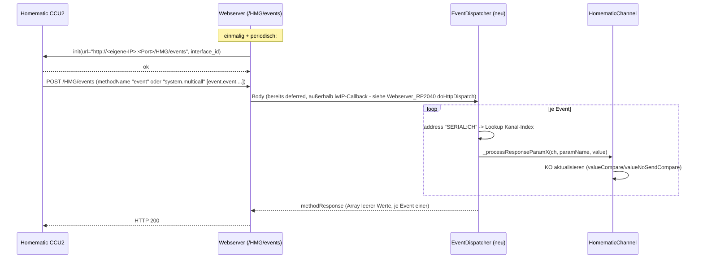
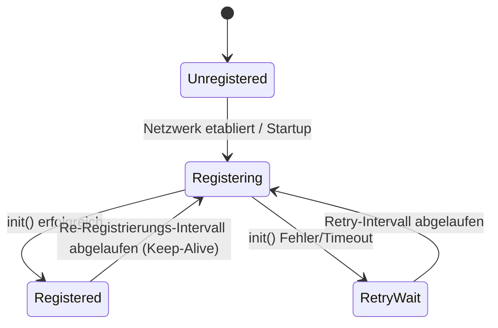

## Skizze: Event-basierte CCU2-Callbacks (nur Entwurf, keine Umsetzung)

### Überblick / Ablauf

### 1) Eingehender Endpoint

- Neue Route `POST /HMG/events` (fest hinterlegter Pfad, nicht per ETS konfigurierbar) via `openknxNetwork.webserver.addRoute(WEB_POST, "/HMG/events", handler)`.
- **Voraussetzung:** `OPENKNX_WEBSERVER` ist für OAM-Homematic aktuell **nicht** gesetzt (nur `OPENKNX_WEBCLIENT`) → wird für dieses Vorhaben aktiviert (entschieden). Weitere darüber freigeschaltete Features (Übersichtsseite/Filemanager/Console) bleiben ohne eigene Flags weiterhin inaktiv.
- Handler bekommt Rohkörper über `req.body()`/`req.bodyLength()`, parst mit `tinyxml2` (bereits Abhängigkeit) und unterscheidet `methodName`:
  - `"event"` → einzelnes Event: Params `[interface_id, address("SERIAL:CH"), value_key, value]`.
  - `"system.multicall"` → Array mehrerer `{methodName, params}` – CCU2 bündelt Events so, insbesondere massenhaft nach eigenem Neustart.
  - alles andere (`system.listMethods`, `newDevices`, `deleteDevices`, `ping`, …) → generische leere Antwort, damit die CCU keine Fehler loggt.
- Antwort ist immer ein gültiges `methodResponse` (bei Multicall: Array mit einem leeren Wert je Aufruf).
- Gut: Auf RP2040 verarbeitet Webserver_RP2040.cpp HTTP-Requests bereits **außerhalb** des lwIP-Callback-Stacks (`doHttpDispatch()` aus `loop()`), das bestehende "Queue-and-Defer"-Pattern aus dem Webconsole gilt hier also schon automatisch – kein zusätzlicher Mechanismus nötig.
- **Body-Limit/große Bursts (`system.multicall` nach CCU-Neustart):** nachrangiges Problem, vorerst tolerieren + loggen – fehlende Werte holt das nächste Polling nach. Ein robusteres Streaming-Parsing (`OPENKNX_WEBSERVER_MAX_BODY`, 4 KB RP2040 / 32 KB ESP32) kann bei Bedarf später nachgezogen werden, ist für die erste Umsetzung nicht erforderlich.

### 2) Registrierung (`init`)

- CCU muss angewiesen werden, Events an uns zu senden: XML-RPC-Call `init(url, interface_id)` auf demselben Interface (`ParamHMG_Host`/`ParamHMG_Port`), das auch für `getParamset`/`setValue` genutzt wird.
  - `url` = `http://<eigene Geräte-IP>:<Webserver-Port>/HMG/events`
  - `interface_id` = stabiler, eindeutiger String (z. B. abgeleitet aus Seriennummer/Hostname)
- Deregistrierung (optional, sauberes Beenden): `init("", interface_id)`.
- **Re-Registrierung nötig**, da die CCU registrierte Listener nach eigenem Neustart vergisst und wir das nicht direkt erkennen können → periodisches erneutes `init()` als Keep-Alive, Intervall **15 Minuten** (entschieden).
- Passt als weiterer "Job" in den zuvor skizzierten Scheduler (einmalig bei Start + periodisch).

**Registrierungs-Zustand (modul-/interface-weit):**

### 3) Zuordnung Event → Kanal

- Es fehlt aktuell eine Umkehr-Tabelle Seriennummer(+Subkanal) → lokaler `_channelIndex`. Diese müsste in `HomematicModule::setup()` einmalig aus `ParamHMG_dDeviceSerialStr` je Kanal aufgebaut werden (statisches Array, kein Heap).
- Danach kann das Event direkt an denselben Werte-Handler weitergereicht werden, den auch die Polling-Antworten nutzen: `_processResponseParamDouble/_processResponseParamInt32/_processResponseParamBool` – aktuell `private` in `HomematicChannel`, bräuchte also eine kleine Öffnung (z. B. `protected` + `friend class EventDispatcher`, oder ein schlanker `public`-Wrapper).
- Unbekannte Seriennummer/Kanal im Event → defensiv ignorieren + Debug-Log (Konvention laut AGENTS.md).

### 4) Zusammenspiel mit Polling

- Events sind eine **zusätzliche**, schnellere Quelle für KO-Updates, ersetzen das Polling nicht (Polling bleibt u. a. für Erstsynchronisation und als Fallback nötig).
- **Reachable-Semantik (entschieden):** Ein empfangenes Event zählt ebenfalls als "Lebenszeichen" und fließt positiv in die `unreach`/Gruppen-Aggregation (`updateDeviceStates`) ein – nicht mehr rein pollbasiert. D. h. der Empfang eines Events für einen Kanal setzt dessen `unreach`-Zustand analog zu einer erfolgreichen Poll-Antwort zurück.

### 5) Entscheidungen (Zusammenfassung)

1. **Webserver:** `OPENKNX_WEBSERVER` wird für dieses Vorhaben aktiviert.
2. **Große Event-Bursts (`system.multicall`):** nachrangig behandeln – tolerieren + loggen, fehlende Werte holt das nächste Polling nach. Streaming-Parsing ist eine mögliche spätere Erweiterung, nicht Teil der ersten Umsetzung.
3. **Reachable-Semantik:** Events sollen für Erreichbarkeit sorgen (siehe Abschnitt 4).
4. **Callback-Pfad/Intervall:** fester Pfad `/HMG/events`, Re-Registrierungsintervall 15 Minuten.

Dieser Entwurf ist damit umsetzungsreif; verbleibende Detailfragen (z. B. genaues Interface-ID-Format, Fehlerverhalten bei `init()`-Fehlschlägen) können bei Implementierungsbeginn geklärt werden.

### 6) Implementierungsstatus

#### Abgeschlossen:
- **Event-Endpunkt:** Route `POST /HMG/events` registriert in `setupEventRoute()` ✓
- **XML-RPC Parsing:** Unterstützung für `"event"` (einzeln) und `"system.multicall"` ✓, dedupliziert über `extractEventParameters()`/`processMulticallEvents()`
- **Address-Parsing:** Format "SERIAL:CHANNEL" wird korrekt extrahiert ✓
- **Typ-Erkennung:** Automatische Klassifizierung der Werte als bool/int32/double ✓
- **Channel-Integration:** `_processEventParamBool/Int32/Double()` finden den Kanal per `HomematicChannel::getSerial()`-Vergleich (lineare Suche über alle Kanäle, kein Lookup-Index) und delegieren an die generische Vorlage `_processEventParamGeneric()`, die wiederum die bestehenden `HomematicChannel::_processResponseParamBool/Int32/Double()` aufruft (gleicher Pfad wie beim Polling) ✓
- **Logging:** Ereignisse werden mit Seriennummer und Channel-Nr. geloggt ✓

#### Zu implementieren (weiterhin TODO):
- **Reachability-Update:** Empfang eines Events soll den `unreach`-Status des Geräts aktualisieren bzw. `updateDeviceStates()` anstoßen (aktuell nur aus `HomematicChannel::update()` beim Polling aufgerufen, nicht aus dem Event-Pfad).
- **Serial-Lookup-Optimierung:** Aktuell lineare Suche über `_channels[]` je Event; ein Index (Serial→Kanal) aus `HomematicModule::setup()` wäre effizienter bei vielen Kanälen, ist aber (noch) nicht umgesetzt.

> **Hinweis für Weiterentwicklung:** Bei jeder Änderung an der Event-Verarbeitung (Parsing, Dispatch, Channel-Integration, Reachability) diesen Abschnitt sowie `doc/homematic-async-rpc-design.md` synchron aktualisieren – siehe AGENTS.md.
